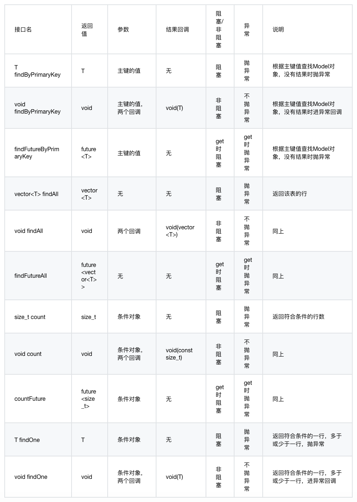
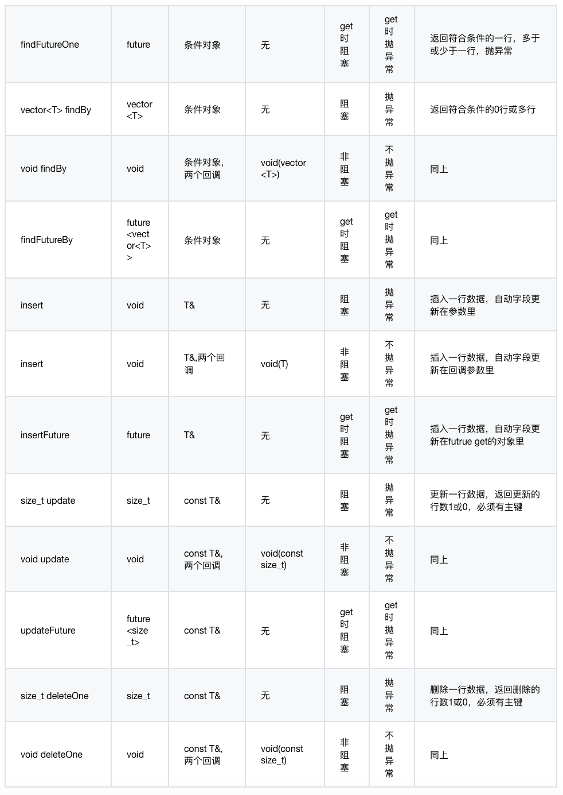

### Model

使用Drogon的ORM支持，首先要创建Model类，Drogon的命令行程序`drogon_ctl`提供了生成Model类的功能，它从用户指定的数据库读取表信息，根据这些信息自动生成多个Model类的源文件。用户使用Model时include对应的头文件即可。

显而易见，每一个Model类，对应一个特定的数据库表，每个Model类的实例，对应表的一行记录。

model类的创建命令如下：

```shell
drogon_ctl create model <model_path>
```

最后一个参数是model存放的路径，该路径内必须有一个配置文件model.json，用以配置drogon_ctl到数据库的连接参数。它是JSON格式的文件，支持注释，例子如下：

```json
{
    "rdbms":"postgresql",
    "host":"127.0.0.1",
    "port":5432,
    "dbname":"test",
    "user":"test",
    "passwd":"",
    "tables":[]
}
```

配置的参数和应用的配置文件一致，请参考[配置文件](CHN-10-配置文件#db_clients)。

tables配置项是它特有的，是一个字符串数组，每个字符串表示要转化成Model的表名，如果该项为空，则所有的表都会生成对应的Model类。

用drogon_ctl create project命令创建的工程目录下已经预先创建了models目录和对应的model.json文件，用户可以编辑配置文件后用drogon_ctl命令创建Model类。

### Model类的接口

用户直接使用的主要有两类接口，getter接口和setter接口。

getter接口又有两类：

* 形如getColumnName的接口，取得该字段的智能指针，取得指针而不是值，主要是为了包含NULL数据的情况，用户可以通过判断该指针是否为空来确定该字段是否是NULL字段。
* 形如getValueOfColumnName的接口，故名思议，该接口是取得值的，出于效率的考虑，该接口返回的是常引用。如果对应字段为NULL，该接口返回第二个参数给定的默认值。

另外，二进制块类型(blob，bytea)有个特殊点的接口，形如getValueOfColumnNameAsString，把二进制数据装进std::string对象返给用户。

setter接口用于设置对应字段的值，形如setColumnName，参数类型和字段类型对应。自动生成的字段比如自增主键是没有setter接口的。

toJson()接口用于把model对象转换成JSON对象，二进制块类型采用base64编码，请用户自行实验。

Model类的静态成员都表示表的信息，比如可以通过`Cols`静态成员获得每个字段的名字，在支持自动提示的编辑器中使用很方便。

### Mapper类模板

Model对象和数据库表的映射都是通过Mapper类模板进行，Mapper类模板封装了常见的增删改查操作，使用户可以不必撰写sql语句即可执行上述操作。

Mapper构造时很简单，模板参数就是你要存取的Model的类型，构造函数只有一个参数，就是前文提到的DbClient智能指针。前文说过，Transaction类是DbClient的子类，所以，你也可以用一个事务的智能指针构造Mapper对象，也就是说Mapper映射也是支持事务的。

象DbClient一样，Mapper也同时提供异步和同步接口。同步接口都阻塞并可能抛异常，返回的future对象在get()时阻塞并可能抛异常，一般的异步接口不会抛异常，而是通过两个回调（结果回调和异常回调）返回结果，其中，异常回调的类型和DbClient接口里的一致，结果回调根据接口功能的不同也分成几类。列表如下（T是模板参数，也就是Model的类型）：





**注意: 使用事务时，异常不必然导致回滚，下面的情况是不会回滚的，当findByPrimaryKey接口未找到符合条件的行时，当findOne接口找到少于或多于一行记录时，会抛异常或进入异常回调，异常类型是UnexpectedRows。如果业务逻辑需要在这种情况下回滚，请显式调用rollback()接口。**

### 条件对象

上一节中，很多接口都需要输入条件对象参数，条件对象是Criteria类的实例，表示某种where条件，比如某个字段大于、等于、小于某个给定值，或者isNull之类的条件。

```c++
template <typename T>
Criteria(const std::string &colName, const CompareOperator &opera, T &&arg)
```

条件对象的构造函数很简单，一般第一个参数是字段名，第二个参数是表示比较类型的枚举值，第三个字段是被比较的值。如果比较类型是IsNull或IsNotNull，不需要第三个参数。

比如：

```c++
Criteria("user_id",CompareOperator::EQ,1);
```

表示，字段user_id等于1作为条件。实践中，我们更愿意写成下面这样：

```c++
Criteria(Users::Cols::_user_id,CompareOperator::EQ,1);
```

跟前面的写法等效，但是这个写法可以有助于编辑器的自动提示，效率更高并且不易出错；

Criteria类还提供了一个自定义构造函数，可以表示自定义的where条件。

```c++
template <typename... Arguments>
explicit Criteria(const CustomSql &sql, Arguments &&...args)
```

构造函数的第一个参数是一个包含了占位符`$?`的`CustomSql`对象，而`CustomSql`类只是一个std::string的包装类。第二个不定参数代表绑定的参数，其行为于[execSqlAsync](CHN-08-1-数据库-Dbclient.md#execsqlasync)中的不定参数一致。

比如：
```c++
Criteria(CustomSql("tags @> $?"), "cloud");
```

`CustomSql`类还拥有一个与之关联的自定义字面量，因此我们更推荐写成下面这样：

```c++
Criteria("tags @> $?"_sql, "cloud");
```

这条语句跟前面的写法等效。

条件对象支持与和或的运算，两个条件对象的与和或会构造出新的条件对象，这样可以方便的构造嵌套的where条件。比如：

```c++
Mapper<Users> mp(dbClientPtr);
auto users = mp.findBy(
(Criteria(Users::Cols::_user_name,CompareOperator::LIKE,"李%")&&Criteria(Users::Cols::_gender,CompareOperator::EQ,0))
||(Criteria(Users::Cols::_user_name,CompareOperator::LIKE,"王%")&&Criteria(Users::Cols::_gender,CompareOperator::EQ,1))
));
```

上面这段程序是从users表里查询所有姓李的男士或者姓王的女士。

### Mapper的链式接口

有些常见的sql约束，比如limit，offset等等，Mapper类模板也提供了支持，以链式接口的形式提供，意味着用户可以把多个约束串起来写。执行完任何一个接口，这些约束会被清空，也就是说，这些约束是在一次操作中有效的，比如：

```c++
Mapper<Users> mp(dbClientPtr);
auto users = mp.orderBy(Users::Cols::_join_time).limit(25).offset(0).findAll();
```

这段程序是从users表中选择用户列表，每页25行的第一页。

链式接口基本可以望文生义，这里不再一一赘述，请参考Mapper.h头文件。

### 转换

`convert`配置选项是模型配置所独有的。在从数据库读取值或将值写入数据库之前或之后，它将添加一个转换层。该选项包含一个布尔值`enabled`组成，以使用此功能或不使用此功能。 `ìtems`数组中的对象由以下键组成：

* `table`: 包含需要转换字段的表的名字
* `column`: 需要转换的字段的名字
* `method`: 转换的方法对象
  * `after_db_read`: 从数据库读出后调用的方法的名字, 签名为: void([const] std::shared_ptr<type> [&])
  * `before_db_write`: 写入数据库前调用的方法的名字, 签名为: void([const] std::shared_ptr<type> [&])
* `includes`: 字符串数组, 表示需要包含的文件，首尾为`"`或`< >`

### 关系

数据库的表与表之间的关系，可以通过model.json配置文件中的relationships选项进行配置，我们采用了手动配置的方式而不是自动探测表的外键是因为现实工程中不使用外键的情况也非常常见。

`enable`选项为true，则生成的model会按照relationships的配置增加相应的接口。

关系共分为三种类型，'has one', 'has many'和'many to many'。

#### has one

`has one` 代表了1对1的关系，原始表中的一条记录可以关联到目标表中的一条记录，反过来也一样。举个例子，产品表和库存单位表是1对1的关系，我们可以定义如下：

```json
{
    "type": "has one",
    "original_table_name": "products",
    "original_table_alias": "product",
    "original_key": "id",
    "target_table_name": "skus",
    "target_table_alias": "SKU",
    "target_key": "product_id",
    "enable_reverse": true
}
```

其中：

* "type": 表示这个关系是1对1；
* "original_table_name": 原始表名字（这个表对应的model中将添加对应的方法）；
* "original_table_alias": 别名（方法中的名字，因为1对1的关系中都是单数，所以设置为`product`），如果这个选项为空，则使用表名生成方法名；
* "original_key": 原始表的关联键；
* "target_table_name": 目标表的名字；
* "target_table_alias": 目标表的别名，如果这个选项为空，则使用表名生成方法名；
* "target_key": 目标表的关联键；
* "enable_reverse": 指明是不是自动生成反向的关系，即在目标表对应的model类中添加获取原始表的记录的方法。

按照这个设置，在products表对应的model类中，将添加如下的方法：

```c++
    /// Relationship interfaces
    void getSKU(const DbClientPtr &clientPtr, 
                const std::function<void(Skus)> &rcb,
                const ExceptionCallback &ecb) const;
```

这是一个异步接口，在回调中返回与当前product相关联的SKU对象。

同时，由于enable_reverse选项设置为真，那么在skus表对应的model类中，将添加如下方法：

```c++
    /// Relationship interfaces
    void getProduct(const DbClientPtr &clientPtr, 
                    const std::function<void(Products)> &rcb,
                    const ExceptionCallback &ecb) const;
```

#### has many

`has many` 代表了一对多的关系，这样的关系中，代表了`多`的那个的那个表一般会有个字段和另一个表的主键相关联。比如产品和评价通常是一对多的关系，我们可以定义如下：

```json
{
    "type": "has many",
    "original_table_name": "products",
    "original_table_alias": "product",
    "original_key": "id",
    "target_table_name": "reviews",
    "target_table_alias": "",
    "target_key": "product_id",
    "enable_reverse": true
}
```

上面各个配置的含义跟前一个例子一样，这里不再赘述，因为评价有多个，是复数，所以不用另起一个别名了。按照该设置，drogon_ctl create model之后，products表对应的model中，会增加下面的接口：

```c++
    void getReviews(const DbClientPtr &clientPtr, 
                    const std::function<void(std::vector<Reviews>)> &rcb,
                    const ExceptionCallback &ecb) const;
```

reviews表对应的model中，会增加下面的接口：

```c++
    void getProduct(const DbClientPtr &clientPtr, 
                    const std::function<void(Products)> &rcb,
                    const ExceptionCallback &ecb) const;
```

#### many to many

顾名思义，`many to many`代表了多对多的关系，通常，多对多的关系要增加一个中间表，中间表中的每一项对应原始表和目标表中的各1条记录。比如产品和购物车就是多对多的关系，我们可以定义如下：

```json
{
    "type": "many to many",
    "original_table_name": "products",
    "original_table_alias": "",
    "original_key": "id",
    "pivot_table": {
        "table_name": "carts_products",
        "original_key": "product_id",
        "target_key": "cart_id"
    },
    "target_table_name": "carts",
    "target_table_alias": "",
    "target_key": "id",
    "enable_reverse": true
}
```

上面的配置介绍过的选项含义和前面一样，只是对于中间表，多了一项`pivot_table`的配置，里面的选项可以望文生义，这里省略。

按这个配置生成的products的model会添加如下方法：

```c++
    void getCarts(const DbClientPtr &clientPtr, 
                  const std::function<void(std::vector<std::pair<Carts,CartsProducts>>)> &rcb,
                  const ExceptionCallback &ecb) const;
```

carts表的model类会添加如下方法：

```c++
    void getProducts(const DbClientPtr &clientPtr, 
                     const std::function<void(std::vector<std::pair<Products,CartsProducts>>)> &rcb,
                     const ExceptionCallback &ecb) const;
```

### Restful API 控制器

drogon_ctl还可以在创建model的同时，为每个model（或者说表）生成restful风格的controller，使用户在零编码的情况下，就生成了可以对表进行增删改查的API。这些API支持按主键查询、按条件查询、按特定字段排序、值返回指定字段、为每个字段指定别名以隐藏表结构等功能。它由model.json中的`restful_api_controllers`选项控制，相关的自选项在json文件中有相应的注释，用户可以自行尝试。

需要注意的是，每个表的controller都被设计成由一个基类和一个子类组成，其中，基类和表密切相关，子类用于提供给用户实现特殊的业务逻辑，或者修饰接口格式。这样设计的好处是，当表结构发生变化的时候，用户可以控制只更新基类而不覆盖子类，保证了开发的连续性。

鉴于这个功能不是那么被普遍需要，这里不做详细介绍了。

# 08.4 [FastDbClient](CHN-08-4-数据库-FastDbClient)