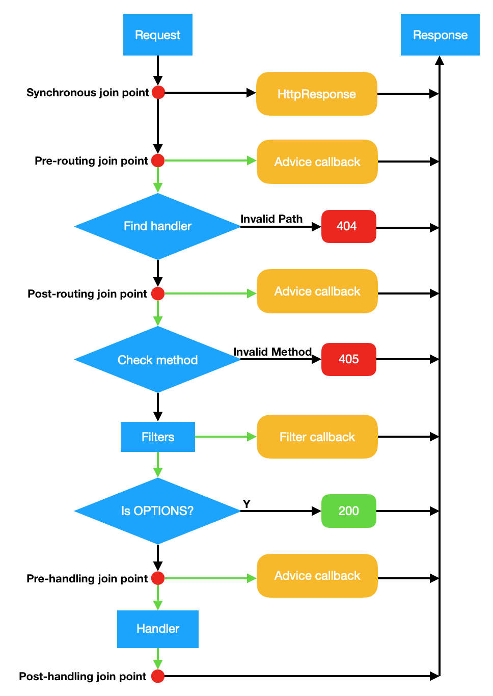

AOP(面向切面编程)是实现程序功能的统一维护的一种技术。利用AOP可以对业务逻辑的各个部分进行隔离，从而使得业务逻辑各部分之间的耦合度降低，提高程序的可重用性，同时提高了开发的效率。

限于C++语言的特性，Drogon没有提供像Spring那样灵活的AOP方案，而是一种简单的AOP，所有插入点都是内建于框架中的，用户可以通过框架的AOP系列接口注册特定的处理程序到插入点上。

### 内建插入点

Drogon提供了7个插入点供用户使用，当应用程序运行至插入点的时候，会依次调用用户注册的处理程序（Advice）。关于插入点的说明如下：

* Beginning: 顾名思义，该插入点在程序开始时到达，具体地说，所有注册在这个插入点上的处理程序会在app().run()方法运行完毕后立即执行。在这个插入点上，所有的controller，filter，plugin，database client都构建完毕了，用户可以在这里得到想要的对象引用或进行一些其他初始化工作，该插入点上的advice只运行一次，调用类型是`void()`，注册接口是`registerBeginningAdvice`;
  
* NewConnection: 注册到这个插入点上的处理程序会在每个新TCP连接建立时运行，Advice的调用类型是`bool(const trantor::InetAddress &, const trantor::InetAddress &)`，其中第一个参数是TCP连接的远端地址，第二个参数是本地地址，注意返回类型是bool，如果用户返回false，相应的连接将被断开。注册的接口是`registerNewConnectionAdvice`;

* HttpResponseCreation: 注册到这个插入点上的处理程序会在每个HTTP Response对象创建时运行，Advice的调用类型是`void(const HttpResponsePtr &)`，其中的参数就是新创建的对象，用户可以在这个处理程序中对所有Response进行一些统一的操作，比如添加某个特殊的header等，这个插入点会影响所有的Response，包括404或任何drogon内部产生的错误响应，也包括应用产生的所有响应。注册的接口是`registerHttpResponseCreationAdvice`;

* Sync: 这个插入点的位置在Http请求处理的最前端，用户可以在这里通过返回一个非空的Response对象来拦截这个请求，Advice调用类型是`HttpRequestPtr(const HttpRequestPtr &)`，注册接口是`registerSyncAdvice`; 
  
* Pre-Routing: 这个插入点的位置在框架为客户端的请求寻找相应的处理器之前，Advice的调用类型有两个，`void(const HttpRequestPtr &,AdviceCallback &&,AdviceChainCallback &&)`和`void(const HttpRequestPtr &)`, 前一个和Filter的doFilter方法的调用类型完全一致，实际上，它们的运行方式也是一样的（请参考[过滤器](CHN-05-过滤器)），用户可以通过这种Advice拦截客户端请求或者让它通过，后一种调用类型没有拦截能力，不过消耗更低，如果用户不打算拦截，请选择这种Advice注册。注册的接口是`registerPreRoutingAdvice`;
  
* Post-Routing: 这个插入点的位置在找到处理器之后和HTTP方法检测及过滤器处理之前，Advice的调用类型和上个插入点一致，注册接口是`registerPostRoutingAdvice`;
  
* Pre-Handling: 这个插入点的位置在通过了所有过滤器之后和处理器处理之前，Advice的调用类型和上个插入点一致，注册接口是`registerPreHandlingAdvice`;
  
* Post-Handling: 这个插入点的位置在处理器处理完成生成Response之后和发送给客户端之前，Advice的调用类型是`oid(const HttpRequestPtr &, const HttpResponsePtr &)`，注册接口是`registerPostHandlingAdvice`;

### AOP示意图

下图展示了上述的后面四个插入点在HTTP Request处理流程中的位置，其中的红色圆点代表插入点，绿色的箭头路径都代表异步调用。

# 13 [性能测试](CHN-13-性能测试)