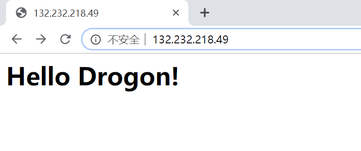

## Static Site
Let's start with a simple example that introduces the usage of drogon. In this example we create a project using the command line tool `drogon_ctl`:

```shell
drogon_ctl create project your_project_name
```

There are several useful folders in the project directory already:

```shell
├── build                         Build folder
├── CMakeLists.txt                Project cmake configuration file
├── config.json                   Drogon application configuration file
├── controllers                   The folder where the controller source files are stored
├── filters                       The folder where the filter files are stored
├── main.cc                       Main program
├── models                        The folder of the database model file
│   └── model.json
└── views                         The folder where view csp files are stored
```

Users can put various files (such as controllers, filters, views, etc.) into corresponding folders. For more convenience and less error, we strongly recommend that users create their own web application projects using the drogon_ctl command. See [drogon_ctl](ENG-11-drogon_ctl-Command) for more details.

Let's look at the main.cc file:

```c++
#include <drogon/HttpAppFramework.h>
int main() {
    //Set HTTP listener address and port
    drogon::app().addListener("0.0.0.0",80);
    //Load config file
    //drogon::app().loadConfigFile("../config.json");
    //Run HTTP framework,the method will block in the internal event loop
    drogon::app().run();
    return 0;
}
```

Then build your project as below:

```shell
cd build
cmake ..
make
```

After the compilation is complete, run the target `./your_project_name`.

Now, we add one simply static file index.html to the Http root path:

```shell
echo '<h1>Hello Drogon!</h1>' >>index.html
```

The default root path is `"./"`, this could be modified by config.json also, See [Configureation File](ENG-10-Configureation-File) for more details. Then you can visit this page by URL `"http://localhost"` or`"http://localhost/index.html"` (or the IP of the server where your wepapp running).




If server cannot find the the page you have requested, it return 404 page:


**Note: Make sure your server firewall have allowed the 80 port, otherwise you won't see these pages.**

We could copy the directory and files of a static website to the startup directory of this running webapp, then we can access them from the browser. The file types supported by drogon are "html", "js", "css", "xml", "xsl", "txt", "svg", "ttf", "otf", "woff2", "woff" , "eot", "png", "jpg", "jpeg", "gif", "bmp", "ico", "icns", etc by default. Drogon also provides interfaces to change these file types. For details, please refer to the [HttpAppFramework API](API-HttpAppFramework). 

## Dynamic Site

Let's see how to add controllers to this application， and let the controller respond contents.

One can use the drogon_ctl command line tool to generate controller source files. Let's run it in the `controllers` directory:

```shell
drogon_ctl create controller TestCtrl
```

As you can see, there are two new files, TestCtrl.h and TestCtrl.cc：

TestCtrl.h is as follows:

```c++
#pragma once
#include <drogon/HttpSimpleController.h>
using namespace drogon;
class TestCtrl:public drogon::HttpSimpleController<TestCtrl>
{
public:
    virtual void asyncHandleHttpRequest(const HttpRequestPtr &req,
                                        std::function<void (const HttpResponsePtr &)> &&callback)override;
    PATH_LIST_BEGIN
    //list path definitions here;
    //PATH_ADD("/path","filter1","filter2",HttpMethod1,HttpMethod2...);
    PATH_LIST_END
};
```
TestCtrl.cc is as follows:

```c++
#include "TestCtrl.h"
void TestCtrl::asyncHandleHttpRequest(const HttpRequestPtr &req,
                                      std::function<void (const HttpResponsePtr &)> &&callback)
{
    //write your application logic here
}
```
Let's edit the two files and let the controller handle the function response to a simple "Hello World!"

TestCtrl.h is as follows:

```c++
#pragma once
#include <drogon/HttpSimpleController.h>
using namespace drogon;
class TestCtrl:public drogon::HttpSimpleController<TestCtrl>
{
public:
    virtual void asyncHandleHttpRequest(const HttpRequestPtr &req,
                                        std::function<void (const HttpResponsePtr &)> &&callback)override;
    PATH_LIST_BEGIN
    //list path definitions here;
    //PATH_ADD("/path","filter1","filter2",HttpMethod1,HttpMethod2...);
    PATH_ADD("/",Get,Post);
    PATH_ADD("/test",Get);
    PATH_LIST_END
};
```

Use PATH_ADD to map processing functions on the two paths '/' and '/test' respectively, and adding constraints on these path.

TestCtrl.cc is as follows:

```c++
#include "TestCtrl.h"
void TestCtrl::asyncHandleHttpRequest(const HttpRequestPtr &req,
                                      std::function<void (const HttpResponsePtr &)> &&callback)
{
    //write your application logic here
    auto resp=HttpResponse::newHttpResponse();
    resp->setStatusCode(k200OK);
    resp->setContentTypeCode(CT_TEXT_HTML);
    resp->setBody("Hello World!");
    callback(resp);
}
```

Recompile this project with cmake, then run the target `./your_project_name`:

```shelll
cd ../build
cmake ..
make
./your_project_name
```

Typing `"http://localhost/"` or `"http://localhost/test"` in the browser address bar, and you will see "Hello World!" in the browser. 

**Note: If your server both have static and dynamic resource, Drogon use dynamic resource first, In this example，the respond of `http://localhost/` is `Hello Word!` in `TestCtrl` controller instead of `Hello Drogon!` in static file index.html.**

We see that adding a controller to an application is very simple. You only need to add the corresponding source file. Even the main file does not need to be modified. This low-coupling design is very effective for web application development.

**Note: Drogon has no restrictions to the location of the controllers source file, you could save it at the project directory also, even you could define new directory in the `CMakeLists.txt`, it is recommended to use the controllers directory for the convenience of management.**

# 04.0 [Controller Introduction](ENG-04-0-Controller-Introduction)